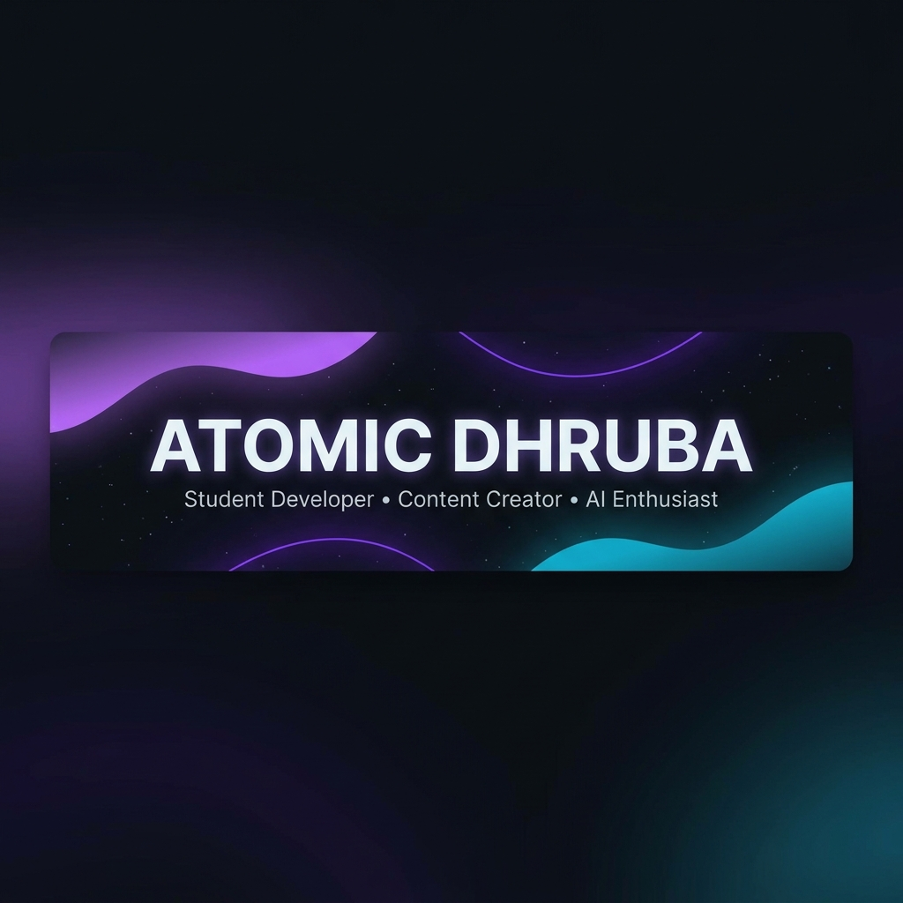

<div align="center">

<!-- BANNER -->


<br/>

<!-- TYPING ANIMATION -->
<a href="https://git.io/typing-svg">
  
</a>

<br/>

<!-- QUICK BADGES -->
[](https://github.com/atomicdhruba)
[](https://github.com/atomicdhruba?tab=followers)

</div>

<br/>

<!-- WAVE DIVIDER -->


##  &nbsp;About Me

```yaml
name: Atomic Dhruba
role: Student Developer & Content Creator
location: India 🇮🇳
currently_building: AI-powered YouTube automation tools
learning: Machine Learning, API integrations, Full-Stack Development
fun_fact: I pit AIs against each other to write better video titles 🤖⚔️🤖
```

<br/>

- 🎓 &nbsp;Student developer passionate about **AI & Automation**
- 🎬 &nbsp;YouTube content creator at **[@AtomicDhruba](https://youtube.com/@AtomicDhruba)**
- 🧠 &nbsp;Building **ZenXYT** — a multi-AI debate engine for viral YouTube metadata
- 🌱 &nbsp;Currently exploring **Gemini AI**, **NVIDIA APIs**, and **advanced prompt engineering**
- ⚡ &nbsp;I believe in: *"Automate the boring stuff, create the exciting stuff"*

<br/>

<!-- WAVE DIVIDER -->


## 🛠️ &nbsp;Tech Stack

<div align="center">

### Languages


### AI & APIs


### Tools & Frameworks


</div>

<br/>

<!-- WAVE DIVIDER -->


## 🚀 &nbsp;Featured Projects

<div align="center">

<a href="https://github.com/atomicdhruba/ZenXYT">
<table>
<tr>
<td width="600" align="center">

### 🧠 ZenXYT

**A multi-AI debate engine for viral YouTube metadata**

Pits **Google Gemini** against **NVIDIA Nemotron** — then merges the best of both worlds.

`Python` `Gemini API` `NVIDIA API` `YouTube API` `CustomTkinter`

[](https://github.com/atomicdhruba/ZenXYT)

</td>
</tr>
</table>
</a>

</div>

<br/>

<!-- WAVE DIVIDER -->


## 📊 &nbsp;GitHub Stats

<div align="center">

<!-- GITHUB STATS CARD -->

&nbsp;&nbsp;&nbsp;
<!-- TOP LANGUAGES -->


<br/><br/>

<!-- STREAK STATS -->


<br/><br/>

<!-- CONTRIBUTION GRAPH -->


</div>

<br/>

<!-- WAVE DIVIDER -->


## 🌐 &nbsp;Connect With Me

<div align="center">

[](https://youtube.com/@AtomicDhruba)
[](https://twitter.com/atomicdhruba)
[](https://instagram.com/atomicdhruba)
[](https://discord.gg/tYHegSaxS)

<br/><br/>

<!-- SNAKE ANIMATION -->
<picture>
  <source media="(prefers-color-scheme: dark)" srcset="https://raw.githubusercontent.com/atomicdhruba/atomicdhruba/output/github-snake-dark.svg" />
  <source media="(prefers-color-scheme: light)" srcset="https://raw.githubusercontent.com/atomicdhruba/atomicdhruba/output/github-snake.svg" />
  
</picture>

<br/><br/>

---

<br/>


**✨ Thanks for visiting! Let's build something amazing together ✨**

<br/>

*"Code is poetry. AI is the pen. YouTube is the stage."*

</div>
